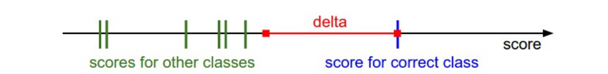

# Linear Classification

### 1. multiclass svm loss

> The Multiclass Support Vector Machine "wants" the score of the correct class to be higher than all other scores by at least a margin of delta. If any class has a score inside the red region (or higher), then there will be accumulated loss. Otherwise the loss will be zero.

假设我们的模型输出一个分类向量$s$，维度（即类别数）为$j$，那么，$s_j$表示类别$j$的值。我们的正解为$y_i$。$Δ$是一个超参，决定正解与非正解的差距。$j \ne y_i$是必须的条件。如果没有这个条件，对于正解的分类，始终会将一个$Δ$加到$loss$中。
$$
L_i=∑ \limits_{j≠y_i} max(0,s_j−s_{y_i}+Δ)
$$

### 2. regularization
这里讲的是对权重进行正则化。假定我们已经有一个$W$可以正确分类了。承以上的$Loss$。如果$s_{y_i} - s_j = dist > \Delta, j \ne y_i$已经成立。那么，$\lambda W$也可以正确地进行分类，但原来的$dist$会变成$2 \times  dist$。这会是一个问题吗？不知道。不过，作者在这里引入了对权重的正则化约束，对大的权重进行惩罚。

> The most common regularization penalty is the L2 norm that discourages large 
weights through an elementwise quadratic penalty over all parameters
$$ R(W) = \sum \limits_k \sum \limits_l W^2_{k,l}$$

添加了正则化项，并考虑了输入的个数N之后，$Loss$公式变成
$$ L = \frac{1}{N}∑_i∑_{j≠y_i}[max(0,f(x_i;W)_j−f(x_i;W)_{y_i}+Δ)]+λ∑_k∑_lW^2_{k,l} $$

我刚刚还在问，大的权重会是一个问题吗？后面就有解答了。
> The most appealing property is that penalizing large weights tends to improve generalization. For example, suppose that we have some input vector $x=[1,1,1,1]$ and two weight vectors $w_1=[1,0,0,0], w2=[0.25,0.25,0.25,0.25].$ Then $w^T_1x=w^T_2x=1$

这个直观的例子是说，对大的权重进行惩罚，使得模型考虑更多的输入，它的权重分布更加弥散，而不是集中在几个很大的权重上。这有什么好处？防止过拟合呀！

但是，也因为有这个权重的正则项，我们的$loss$值基本不会是0，除非权重为0。

### 3. softmax classifier
交叉熵损失
$$ \large
L_i=−log(\frac{e^{f_{y_i}}}{∑_je^{f_j}})
$$

其中里面的就是$softmax$函数。
$$ \large
softmax = \frac{e^{f_{y_i}}}{∑_je^{f_j}}
$$

以下的引言指出，从概率的观点来看，最小化交叉熵损失是在做极大似然估计。
> minimizing the negative log likelihood of the correct class, which can be interpreted as performing Maximum Likelihood Estimation (MLE).

关于计算稳定性的。在实践中，会有上溢的问题。
> Dividing large numbers can be numerically unstable
$$ \large
\frac{e^{f_{y_i}}}{∑_je^{f_j}}
    =\frac{C{e^{f_{y_i}}}}{C∑_je^{f_j}}
    =\frac{e^{{f_{y_i}}+logC}}{∑_je^{{f_j}+logC}}
$$
通常，取$logC = -max_jf_j$，使得$f$中最大值为零。

从技术层面讲，说$softmax loss$其实是没有意义的。但大家都这么用了～他们应该想说的是交叉熵损失。