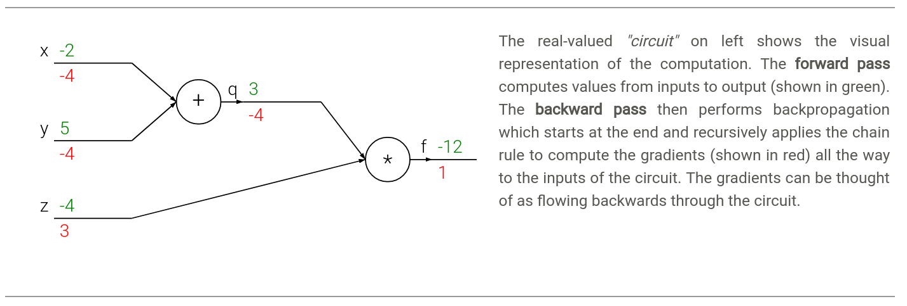
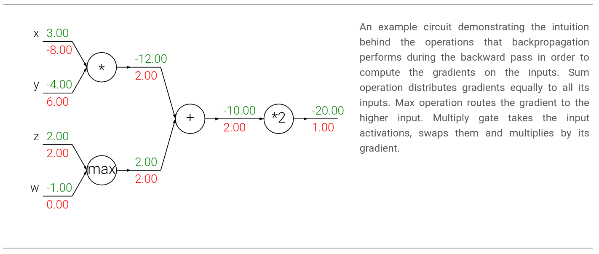

# Backpropagation
反向传播

### 介绍
这一节的目标是让我们对反向传播有一种直觉上的理解。反向传播实际上是利用递归式地应用链式法则来求解梯度的方法。

在人工神经网络中，我们的目标是求出$W,b$的梯度。

### 梯度的简单解释
一个非常简单的例子
$$
f(x,y) = xy \qquad  \rarr \qquad \frac{\partial f}{\partial x} = y \qquad \frac{\partial f}{\partial y} = x
$$
解释一下，导数告诉我们的是，给定一个$x$的值，在它的无穷小的邻域中，函数$f$的变化率。
$$ \frac{df(x)}{dx}=\mathop{lim}\limits_{h→0} \frac{f(x+h)−f(x)}{h} $$

> A nice way to think about the expression above is that when h is very small, then the function is well-approximated by a straight line, and the derivative is its slope. 

> In other words, the derivative on each variable tells you the sensitivity of the whole expression on its value. This can be seen by rearranging the above equation as: 
> $$ f(x+h)=f(x)+h\frac{df(x)}{dx}. $$
> Analogously, since $\frac{∂f}{∂y}=4$, we expect that increasing the value of $y$ by some very small amount $h$ would also increase the output of the function (due to the positive sign), and by $4h$.

不过，我们现在的$x$通常是一个向量，所以我们求的实际上是偏导
$$ ∇f=[\frac{∂f}{∂x},\frac{∂f}{∂y}]=[y,x] $$

### 非常直观的反向传播
核心提示：局部信息



在这一节中，把节点看成是门(gate)，以帮助理解反向传播的原理。如图，$x + y => q$。门是圆圈内的$+$，$q$是门的输出，$x,y$是输入。反向传播时，$q$得到的梯度是$-4$，门将$-4$传播到它自己的输入变量$x,y$去。由$q = x + y$易知$x, y$的**局部偏导**都是$1$，将之乘上门传来的偏导，即可得到其相对于整个输出$f$的偏导。

以下是非常重要的解释：
> Notice that backpropagation is a beautifully **local process**. Every gate in a circuit diagram gets some inputs and can right away compute two things: **1. its output value and 2. the local gradient of its inputs with respect to its output value.** Notice that the gates can do this completely independently without being aware of any of the details of the full circuit that they are embedded in. However, once the forward pass is over, during backpropagation the gate will eventually learn about the gradient of its output value on the final output of the entire circuit. Chain rule says that the gate should take that gradient and multiply it into every gradient it normally computes for all of its inputs.$

一个有趣的例子，求以下函数的前向及反向传播过程。
$$ 
f(x,y) = \frac{x + \sigma(y)}{\sigma(x) + (x+y)^2}
$$

前向传播
```py
x = 3 # example values
y = -4

# forward pass
sigy = 1.0 / (1 + math.exp(-y)) # sigmoid in numerator   #(1)
num = x + sigy # numerator                               #(2)
sigx = 1.0 / (1 + math.exp(-x)) # sigmoid in denominator #(3)
xpy = x + y                                              #(4)
xpysqr = xpy**2                                          #(5)
den = sigx + xpysqr # denominator                        #(6)
invden = 1.0 / den                                       #(7)
f = num * invden # done!                                 #(8)
```

反向传播，反向传播的变量名是前向传播的变量名前面加`d`。
```py
# backprop f = num * invden
dnum = invden # gradient on numerator                             #(8)
dinvden = num                                                     #(8)
# backprop invden = 1.0 / den 
dden = (-1.0 / (den**2)) * dinvden                                #(7)
# backprop den = sigx + xpysqr
dsigx = (1) * dden                                                #(6)
dxpysqr = (1) * dden                                              #(6)
# backprop xpysqr = xpy**2
dxpy = (2 * xpy) * dxpysqr                                        #(5)
# backprop xpy = x + y
dx = (1) * dxpy                                                   #(4)
dy = (1) * dxpy                                                   #(4)
# backprop sigx = 1.0 / (1 + math.exp(-x))
dx += ((1 - sigx) * sigx) * dsigx # Notice += !! See notes below  #(3)
# backprop num = x + sigy
dx += (1) * dnum                                                  #(2)
dsigy = (1) * dnum                                                #(2)
# backprop sigy = 1.0 / (1 + math.exp(-y))
dy += ((1 - sigy) * sigy) * dsigy                                 #(1)
```
从这个过程我们知道些什么呢？

+ 缓存前向传播的值: 因为很明显，方便计算反向传播的偏导。
+ 分支的偏导应相加：比如上面的$x,y$，它们的值输出到了多个部分，所以他们的偏导也是多个部分的偏导之和，


### 另一个非常有趣的洞见


从图中我们可以直观看出
+ add：加操作，会将它的输出的梯度，直接输出到它的输入去。
+ max：这个操作只会把它的输出的梯度，传输给最大的那个输入，其他输入为0
+ mul: 乘操作，它会交换两个输入的值，然后乘上它的输出的梯度

> 思考：如果乘操作中，有两个以上的输入呢？例如
> $$ \because f = xyz$$
> $$ \therefore \frac{df}{dx} = yz$$
> 显然，乘操作会将其他值乘在一起，再乘上它的输出的梯度，作为某个输入的梯度。

这里引申出一个非常重要的观察。如果乘操作的两个输出中，一个非常小，一个非常大。那在计算梯度的时候，小的值会得到一个非常大的梯度，大的值会得到非常小的梯度。由于在线性分类器中，输入的scale会直接影响权重的梯度，那么在更新的时候，就需要用比较小的学习率来抵消这种影响了。这也就是为什么预处理是很关键的。

### 向量化求偏导
```py
# forward pass
W = np.random.randn(5, 10)
X = np.random.randn(10, 3)
D = W.dot(X)

# now suppose we had the gradient on D from above in the circuit
dD = np.random.randn(*D.shape) # same shape as D
dW = dD.dot(X.T) #.T gives the transpose of the matrix
dX = W.T.dot(dD)
```
向量化求偏导的trick就是对齐维度。从理解原理的角度，可以自己先推导一遍，后续应用时，只需要将维度对齐就可以了。这是比较实际的做法。