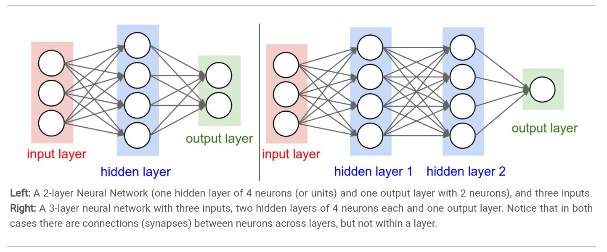

# Neural-network
神经网络

神经网络源于生物学上对人脑的研究，不过后来已经变成一种工程方法跟数学模型了。

### 激活函数
+ Sigmoid
  + 在极值点会导致梯度消失
  + 它不是零均值的，不过这个影响不大。因为在神经网络的后面那些层里面，它们的数据也不是零均值的。当然，这会使得梯度的更新变成锯齿状的。如果处理一个batch的数据，它们有不同方向的梯度，这会多多少少缓解这个问题。
+ Tanh
  + 也会梯度消失
  + 零均值。所以prefered to sigmoid
  + $tanh(x) = 2\sigma(2x) - 1$
+ ReLU
  + 发现能加速训练，因为解决了梯度消失问题
  + 操作简单，只是把小于零的置零
  + 会造成死神经元，因为有可能它的梯度永远为0
+ Leaky ReLU
  + 给ReLu的小于0的部分加一个小数0.01，缓解死元问题
+ Maxout
  + 为ReLU及Leaky的通用版本，但是多个参数
  + $max(w^T_1x+b_1,w^T_2x+b_2)$

#### 建议
使用Relu，或者Leaky或者Maxout。可以使用tanh，但它的输出应该没有Relu好，不推荐Sigmoid

### 神经网络

如何计算神经网络的大小，亦即，参数量？

> The first network (left) has 4 + 2 = 6 neurons (not counting the inputs), [3 x 4] + [4 x 2] = 20 weights and 4 + 2 = 6 biases, for a total of 26 learnable parameters.
> The second network (right) has 4 + 4 + 1 = 9 neurons, [3 x 4] + [4 x 4] + [4 x 1] = 12 + 16 + 4 = 32 weights and 4 + 4 + 1 = 9 biases, for a total of 41 learnable parameters.

#### 正则化

虽然在实践中没用过对权重的正则化，所以这幅图看起来印象深刻！