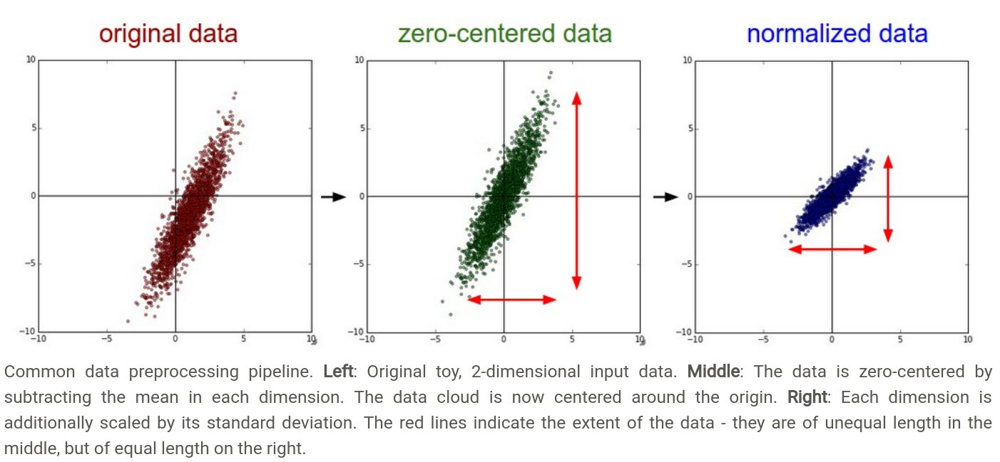
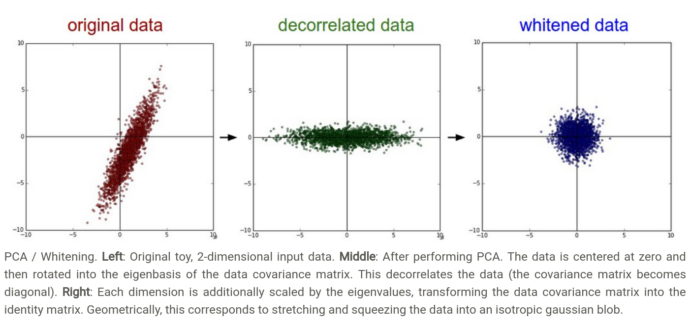
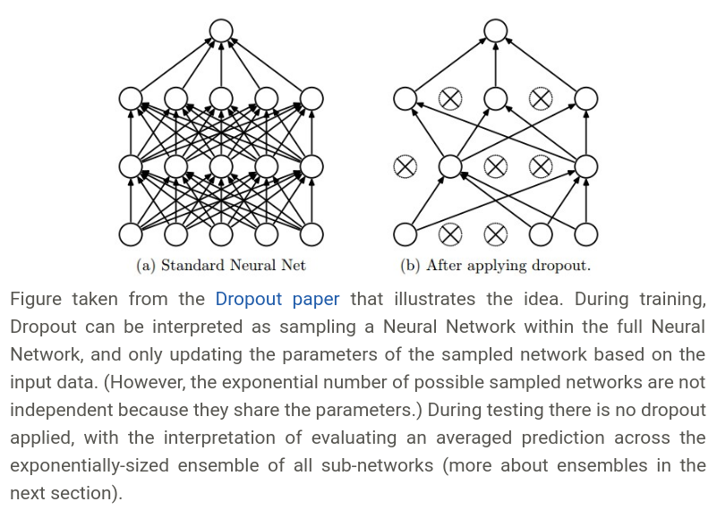

# Neural-network
神经网络


## Data Preprocession
设若我们的数据是`X`，且`X.shape => (N x D)`。`N`是样本数，`D`代表维度。

主要有三种形式的预处理

+ mean subtraction（减平均值）:这种处理方式最常见，目的是centering the cloud of data around the origin along every dimension.将所有的数据对齐到原点。比如说(3, 4, 5)，它们的均值是4,减去4之后变成了(-1, 0, 1)。如果是二维的数据，则是每一维减去它所在那一维的均值。如果是在图像处理上，由于图像多个维度都是像素值，而不像其他数据各个维度的含义有所不同。因此，图像可以直接减去整个图像的平均像素，或者按通道(channel)来减。`X -= np.mean(X)`

+ normalization（规范化）:normalizing the data dimensions so that they are of approximately the same scale.不同维度的取值范围差异可能非常大，比如房价，和面积，因此，需要换算到同个范围。有两种方式来实现规范化：一种是每个维度除以它的标准差，这样就变成了zero-centered的了。`X /= np.std(X, axis=0`。另一种处理方式是使得每一维度的最小值变成-1,最大值变成1。



+ PCA and Whitening（主成分分析及白化）:这种做法，首先要先用上述方法进行中心化，然后计算协方差矩阵。
```py
# X.shape => (N x D)
X -= np.mean(X, axis=0) # zero center the data
cov = np.dot(X.T, X) / X.shape(0) # get covariance matrix
```
第(i,j)个元素存放着第i,j维的方差。因为协方差矩阵是对称的半正定矩阵，因此可以以进行奇异值分解。
```py
U, S, V = np.linalg.svd(cov)
```
`U`的列是特征向量，`S`是一个一维的奇异值向量。
为了去掉原数据的相关性(decorrelate the data)，我们将经过中心化的原数据映射到单位向量基上。
```py
Xrot = np.dot(X, U)
```
注意到`U`的列是正交向量的集合，因此可以作为基向量。`Xrot`相当于是对原`X`的数据进行了旋转，新的坐标轴是特征向量。如果我们计算`Xrot`的协方差矩阵，可以看到它现在是对角阵了。`np.linalg.svd`一个好的特性是它的返回值`U`是排序的。因此，我们可以只取其前面的部分，这种做法也叫做主成分分析PCA降维。
```py
Xrot_reduced = np.dot(X, U[:, 100])
```
通过这种操作，我们将`X`的维度缩小到了100。通常这会带来模型性能的提升。

另一种经常在实践中使用的方法是白化。白化是将在特征基空间下的数据，每个维度除以特征值来规范值域。几何解释为：如果输入数据的分布是multivariable gaussian，那么白化后的数据就会是零中心值，它的协方差矩阵将是单位阵。
```py
# whiten the data:
# divide by the eigenvalues (which are square roots of the singular values)
Xwhite = Xrot / np.sqrt(S + 1e-5)
```



原教程给了一个[不错的图](http://cs231n.github.io/neural-networks-2/)，可以看看。

**In practice.** We mention PCA/Whitening in these notes for completeness, but these transformations are not used with Convolutional Networks. However, it is very important to zero-center the data, and it is common to see normalization of every pixel as well.

**Common pitfall.** 正确的做法是，在训练集上做预处理，然后将同样的预处理过程应用于验证集和测试集，而不是在整个数据集上做预处理，再划分数据集来训练。

## Weight Initialization

首先，不要将所有的权重初始化为0！一般是初始化为很小的随机数。
```py
W = 0.01 * np.random.randn(D, H)
```

然后，校正方差。
```py
W = np.random.randn(D, H) * np.sqrt(n)
```
原文作了详细的解释，后一项如何得出。

后面有一些论文专门分析了初始化的问题。何恺明提出，对于使用ReLU的神经网络模型，应该使用
```py
W = np.random.randn(n) * np.sqrt(2.0/n)
```

至于bias的初始化，一般是直接置0啦！


## Batch Normalization
[论文](https://arxiv.org/abs/1502.03167)对此做了非常详细的解释。因此课程没有展开。希望未来可以见我的笔记！

## Regularization

L2 regularization:之前已经讲过，不过这一段仍然非常精彩。
> The L2 regularization has the intuitive interpretation of heavily penalizing peaky weight vectors and preferring diffuse weight vectors. As we discussed in the Linear Classification section, due to multiplicative interactions between weights and inputs this has the appealing property of encouraging the network to use all of its inputs a little rather than some of its inputs a lot.

L1 regularization: 通常来说，L1正则化会使得许多的参数值变为0,仅使用少数特征。
> Neurons with L1 regularization end up using only a sparse subset of their most important inputs and become nearly invariant to the “noisy” inputs.In comparison, final weight vectors from L2 regularization are usually diffuse, small numbers. In practice, if you are not concerned with explicit feature selection, L2 regularization can be expected to give superior performance over L1.

Max norm constraits: 这种方法是进行权重的截断。In practice, this corresponds to performing the parameter update as normal, and then enforcing the constraint by clamping the weight vector $w⃗$ of every neuron to satisfy $∥w⃗∥^2<c$. Typical values of c are on orders of 3 or 4. 

Dropout: dropout is implemented by only keeping a neuron active with some probability p (a hyperparameter), or setting it to zero otherwise.



关于Dropout这里有一段分析，贴上代码更直观些：
```py
""" Vanilla Dropout: Not recommended implementation (see notes below) """

# 我们设置keep_prob = 0.5
p = 0.5 # probability of keeping a unit active. higher = less dropout

def train_step(X):
  """ X contains the data """
  
  # forward pass for example 3-layer neural network
  H1 = np.maximum(0, np.dot(W1, X) + b1)
  # 这里是生成一个mask，抑制掉H1部分输入
  U1 = np.random.rand(*H1.shape) < p # first dropout mask
  H1 *= U1 # drop!
  H2 = np.maximum(0, np.dot(W2, H1) + b2)
  U2 = np.random.rand(*H2.shape) < p # second dropout mask
  H2 *= U2 # drop!
  out = np.dot(W3, H2) + b3
  
  # backward pass: compute gradients... (not shown)
  # perform parameter update... (not shown)
```
由于部分输入被抑制了，输入的数学期望变成了$px+(1−p)0$，由此要在测试时保持同样的期望，就得乘上一个$p$，见以下代码
```py
def predict(X):
  # ensembled forward pass
  H1 = np.maximum(0, np.dot(W1, X) + b1) * p # NOTE: scale the activations
  H2 = np.maximum(0, np.dot(W2, H1) + b2) * p # NOTE: scale the activations
  out = np.dot(W3, H2) + b3
```

不过这种做法不推荐，因为需要在测试阶段对每个输出都乘以$p$，因此，`inverted dropout`是更推荐的做法。基本就是在训练时做了反转，可以不对测试过程做任何处理。见代码
```py
""" 
Inverted Dropout: Recommended implementation example.
We drop and scale at train time and don't do anything at test time.
"""

p = 0.5 # probability of keeping a unit active. higher = less dropout

def train_step(X):
  # forward pass for example 3-layer neural network
  H1 = np.maximum(0, np.dot(W1, X) + b1)
  U1 = (np.random.rand(*H1.shape) < p) / p # first dropout mask. Notice /p!
  H1 *= U1 # drop!
  H2 = np.maximum(0, np.dot(W2, H1) + b2)
  U2 = (np.random.rand(*H2.shape) < p) / p # second dropout mask. Notice /p!
  H2 *= U2 # drop!
  out = np.dot(W3, H2) + b3
  
  # backward pass: compute gradients... (not shown)
  # perform parameter update... (not shown)
  
def predict(X):
  # ensembled forward pass
  H1 = np.maximum(0, np.dot(W1, X) + b1) # no scaling necessary
  H2 = np.maximum(0, np.dot(W2, H1) + b2)
  out = np.dot(W3, H2) + b3
```

## Loss functions
假设$f = f(x_i; W)$是网络的输出层。

### Classification
对于分类问题，有两种loss函数的选择，一种是SVM分类器使用的损失
$$ L_i = \sum \limits_{j \ne y_i} max(0, f_j - f_{y_i} + 1) $$

另一种是Softmax分类器使用交叉熵损失
$$ L_i = -log (\frac{e^{f_{y_i}}}{\sum_j e^{f_j}})$$

问题：类别数量大。解决方法是使用多层级的Softmax，以一种树型结构来进行分类。


### Attribute classification
如果网络的输出$y_i$是一个二值向量(binary vector)，代表某个属性是有还是没有。这时一个看起来可行的方案是针对每一个属性建一个二值分类器
$$ L_i = \sum \limits_j max(0, 1 - y_{ij}f_j)$$
where the sum is over all categories $j$, and $y_{ij}$ is either +1 or -1 depending on whether the $i-th$ example is labeled with the $j-th$ attribute, and the score vector $f_j$ will be positive when the class is predicted to be present and negative otherwise.

另一种方式是用logistic分类器来独立预测每一个分类。

### Regression
常见的是L1和L2损失。

### Structured prediction


**注意**:L2损失更难训练，因为它对每一个输出值敏感，而softmax并不关心具体的值。